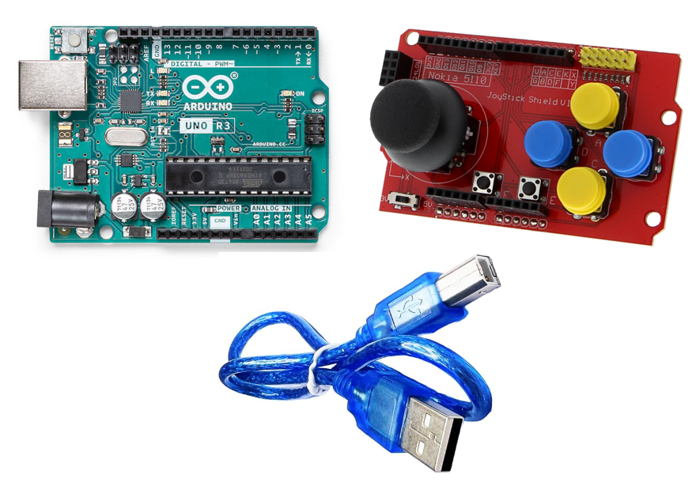
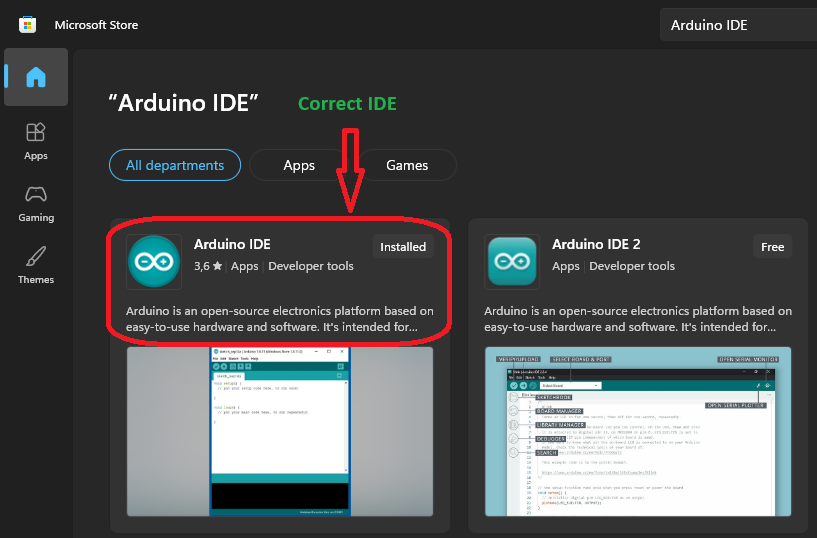
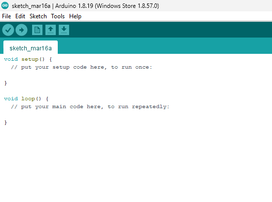
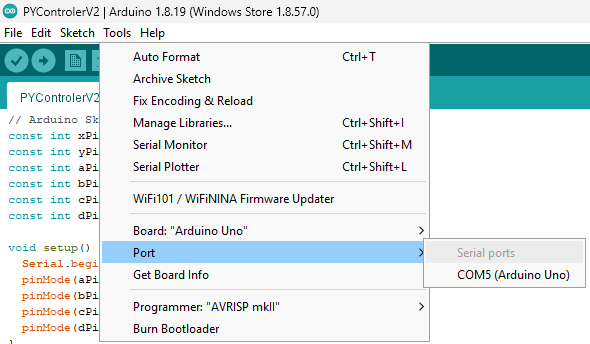

# 🎮 Arduino Joystick Shield (Funduino) –

# Complete 10-Step Guide

This guide explains **step by step** how to install, connect, test, and use a **Joystick Shield Funduino** with
an Arduino Nano or UNO.

## 1️⃣ Needed hardware

You will need:


* Arduino Nano or Arduino UNO
* Joystick Shield Funduino
* USB-A to USB-B cable
* Laptop
* Needed OS is Windows 11



## 2️⃣ Installation (Windows – Microsoft Store)
### ⚠️ IMPORTANT
For this project you must use^ **Arduino IDE 1.8.x (Classic)**.
Do **NOT** use Arduino IDE 2.^
```
1. Open the Microsoft Store
2. Search for Arduino IDE
3. Install Arduino IDE
```


```
4. Start the Arduino IDE
5. Check the version via:
6. Help → About^
```
### ✅ The version must be **1.8.x**


## 3️⃣ Connect the arduino to the pc/ laptop


* Connect the Arduino to your computer using a USB cable

## 4️⃣ Open Arduino IDE

```
. Open Arduino IDE (Classic)
. Wait until the Arduino is detected by the system
```


## 5️⃣ Select the correct COM port




* Go to Tools → Port
* Select the COM port that appears when the Arduino is connected
(for example: COM3, COM4, COM7)^

## 6️⃣ Upload the Arduino code

Paste the following code into the Arduino IDE:

```
// Arduino Sketch for Joystick Shield Funduino
// Pin mapping:
// Y-axis -> A
// Button A -> D
// Button B -> D

const int yPin = A1; // Joystick Y-axis
const int aPin = 2; // Button A
const int bPin = 3; // Button B

void setup() {
Serial.begin(9600); // Start serial communication
pinMode(aPin, INPUT_PULLUP); // Button A with internal pull-up
pinMode(bPin, INPUT_PULLUP); // Button B with internal pull-up
}

void loop() {
// Read raw joystick values (0–1023)
int yRaw = analogRead(yPin);

// Normalize around center (approx. 512)
int y = yRaw - 512;
```
```
// Deadzone to prevent joystick drift
if (abs(y) < 50) y = 0;

// Read buttons (pressed = 1)
int a = digitalRead(aPin) == LOW? 1 : 0;
int b = digitalRead(bPin) == LOW? 1 : 0;

// Send data format: Y,A,B
Serial.print(y);
Serial.print(",");
Serial.print(a);
Serial.print(",");
Serial.println(b);

delay(10); // ~100 updates per second
}
```
### Upload steps

- Click **✅️ Verify**
- Click **➡ Upload**
- Wait for **“Done uploading”**


## 7️⃣ Test using the Serial Monitor


1. Open Tools → Serial Monitor
2. Set:
Baud rate: 9600
Line ending: None or Newline

### Example output:

- 0,511,0,
- 0-512,1,0,

### Format:

#### Y , A , B

```
Y → up / down
A → button A (1 = pressed)
B → button B (1 = pressed)
```
## ✅ Ready to use for the python game

Your Arduino now:

```
Sends joystick data correctly
Sends button states correctly
Is ready for Python ( pyserial )
```

