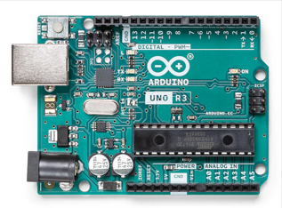
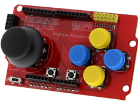

# Exchange program Summa ICT 2026

#### This year with the spacnsih exchange program we are going to make a game with python and making controllers using Arduino and funduino's.

- Demo video of the game: https://youtu.be/mk0BxJUisdA

##### What you just saw in the demo video is the base game we are going to work on today. We have to different variants of the exercise:

- What we have done for the first manual is divided the game up into sections, so you can chose between 6 different paths to work on. 
  This is a way to make the game more fun and interactive, because you can choose what you want to work on with your group of course.

- The second manual is to make the full base game, but also have divided this into 4 different difficulties, so you can choose how much of the game you want to make. This is a way to make the game more fun and interactive, because you can choose how much of the game you want to make with your group of course.